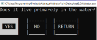

# Akinator (Console Edition)

## Description
This project is a custom implementation of the popular **Akinator** game, developed collaboratively with a classmate.  
It is a **console-based application written in C#**, using a **Tree data structure** to store and process knowledge.

---

## Concept and Implementation
The game asks a series of **yes/no questions**, gradually narrowing down the possible answers until it tries to guess what the player is thinking of.  

If the program fails to guess correctly, it prompts the player to **add a new question** that would help distinguish the new object from the previously known ones.  
This allows the system to **“learn”** from each session — implementing a **primitive form of machine learning**, where the tree dynamically expands based on user interactions.

---
## Screenshots

---

## Technologies Used
- **Language:** C#  
- **Type:** Console Application  
- **Data Structure:** Binary Tree  
- **Logic:** Interactive learning through user input  
- **Knowledge Storage:** Dynamically growing tree with new nodes added by the player
